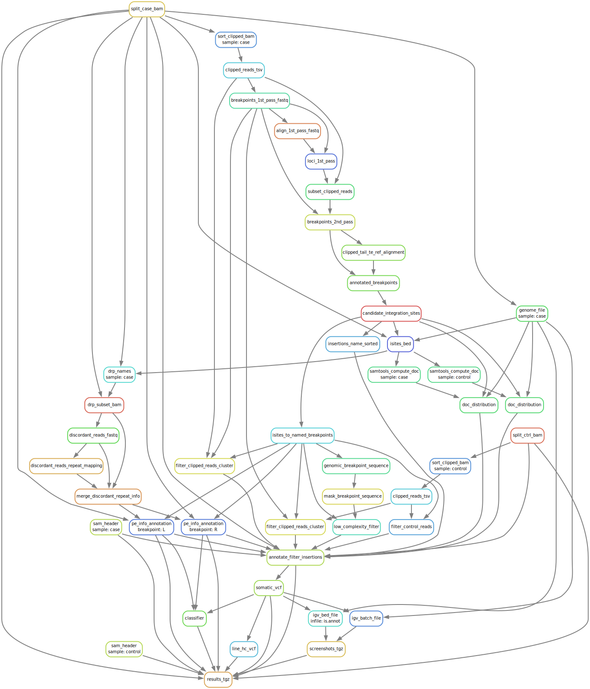

TotalReCall - code for somatic retrotransposon detection from short read whole genome sequencing data

## Installation
TotalReCall is installed as a Python package either calling `setup.py` or using `pip`. Installed scripts and Python
modules are then used by the Snakemake workflow.

It is recommended to use Docker to run it.
Provided Dockerfile bundles the code and the data (transposon references, genome sequence)together.

Pre-built Docker images are provided on Dockerhub:

`docker pull crankycrank/totalrecall:demo-hg19` for the demo data (see `demo/` subdirectory in this repository)

`docker pull crankycrank/totalrecall:tcga-paper` for TCGA data

Instruction to reproduce the build of these Docker images if one wishes to do so are provided below.

### Building Docker image
Clone the repository, from the main directory of the repository run
```
tar -czf totalrecall.src.tgz $(git ls-files)
```
followed by
```
Docker build . -t totalrecall:devel
```
This will build the Docker container image for the current version of TotalReCall.

To build the container image the following files are needed:

`files/hg38.tgz` - archive with the genome and the index: `genome.fa.gz`, `genome.fa.gz.fai`, `genome.fa.gz.gzi`

`files/igv_211.tgz` - IGV

`files/samtools` - newer version of samtools

To build the container image for the demo dataset build the reference for `hg19`:
```
wget ftp://ftp.1000genomes.ebi.ac.uk/vol1/ftp/technical/reference/phase2_reference_assembly_sequence/hs37d5.fa.gz
mv hs37d5.fa.gz genome.fa.gz
samtools faidx genome.fa.gz
tar -czf hg19.tgz genome.fa.gz genome.fa.gz.fai genome.fa.gz.gzi
mv hg19.tgz files
```
and build using the custom genome:
```
docker build --build-arg genome_tar="files/hg19.tgz" . -t totalrecall:demo
```

## Running
To run the code:

* Place `case.bam`, `case.bam.bai`, `control.bam`, `control.bam.bai` into the project directory
* Run using the container:
```
snakemake -j 1 -s /opt/totalrecall/Snakefile -p results.tgz
```
(Run with `-j $NUM_THREADS` instead of 1 to use multithreading.)
Archive with the results `results.tgz` contains the results, inluding the list of LINE1 elements `line.vcf`.

Makre sure to set `LC_COLLATE=C` to ensure the same lexicographical sort order betwen the OS `sort` command and python `sort` (the latter uses Unicode, which coincides with the ASCII table for the numbers and the Latin characters).

### Example data
See the `demo` directory for example data and instruction on how to run the code on them.

##  DAG of Snakemake workflow

